# taskmaster

### Lab 26 - Beginning TaskMaster
#### The main page
should have a heading at the top of the page, an image to mock the “my tasks” view, and buttons at the bottom of the page to allow going to the “add tasks” and “all tasks” page.

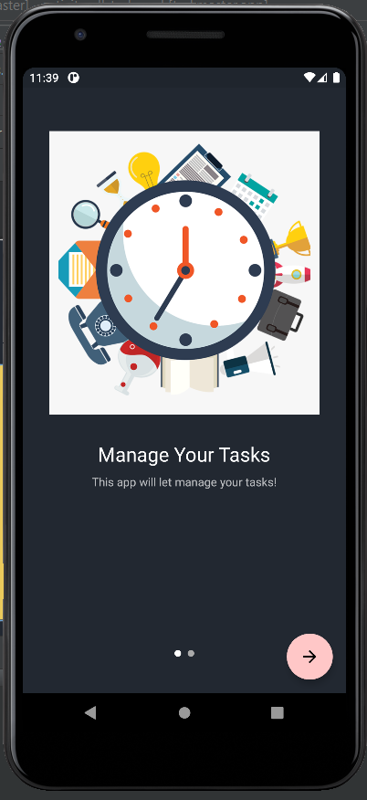
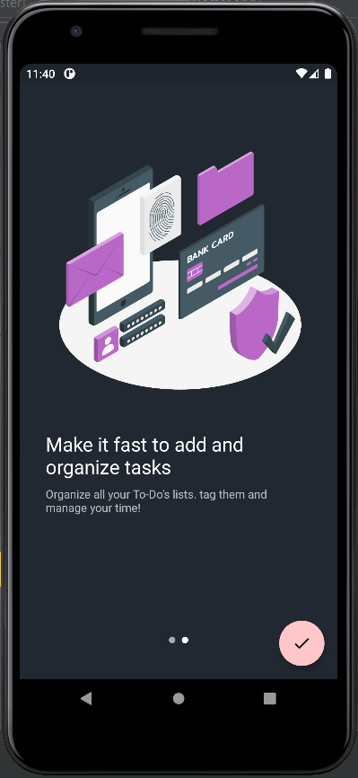

#### Add a Task
On the “Add a Task” page, allow users to type in details about a new task, specifically a title and a body. When users click the “submit” button, show a “submitted!” label on the page.
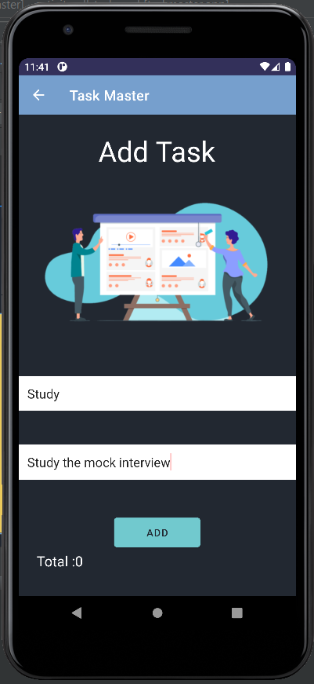

#### All Tasks
The all tasks page should just be an image with a back button; it needs no functionality.

---

### Lab 27 - 
### Task Detail Page
Create a Task Detail page. It should have a title at the top of the page, and a Lorem Ipsum description.
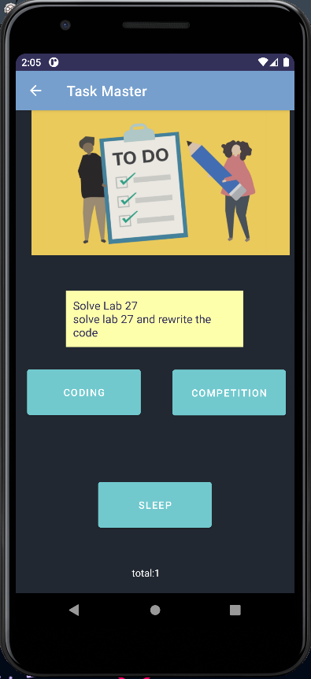

### Settings Page
Create a Settings page. It should allow users to enter their username and hit save.
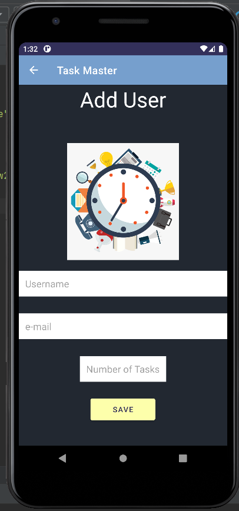

### Homepage
The main page should be modified to contain three different buttons with hardcoded task titles. When a user taps one of the titles, it should go to the Task Detail page, and the title at the top of the page should match the task title that was tapped on the previous page.
The homepage should also contain a button to visit the Settings page, and once the user has entered their username, it should display “{username}’s tasks” above the three task buttons.
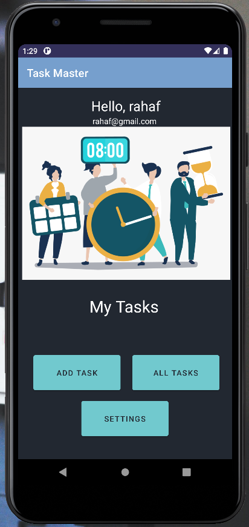

--- 

### Lab 28 - RecyclerView
*refactor  homepage to look snazzy, with a RecyclerView full of Task data.
#### Homepage
Refactor your homepage to use a RecyclerView for displaying Task data. This should have hardcoded Task data for now.

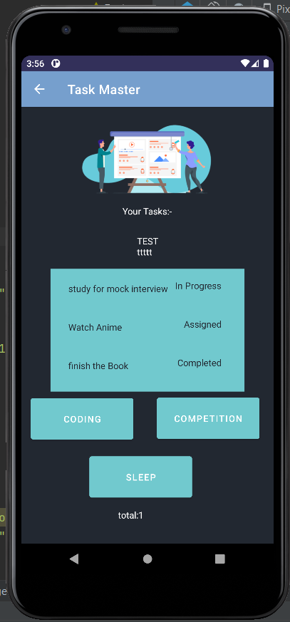
#### updated Tasks
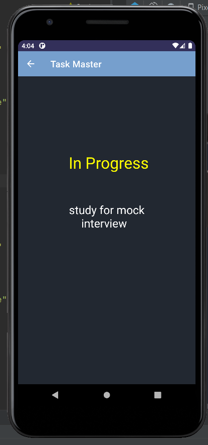
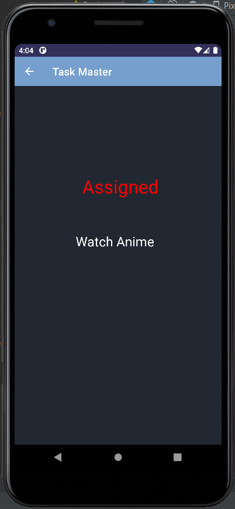
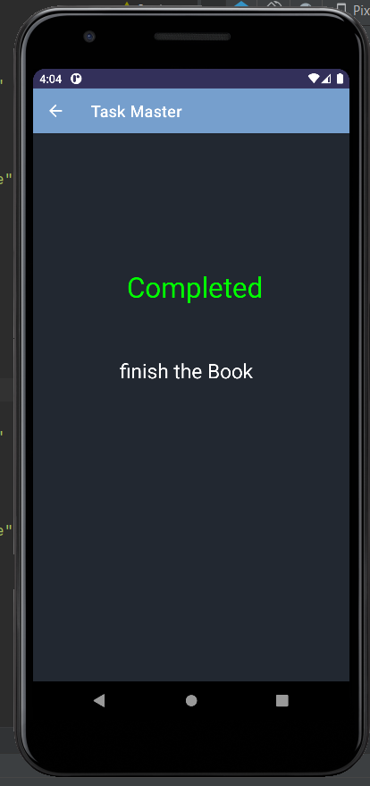

---

### Lab 29 - Room
In this lab, I added a Room database to save the tasks and the details of tasks and get data from it, and let the recycler view take the data from the room database.

#### Add Task Activity
On this page, Added a new field in which can the user writes the state of the task.

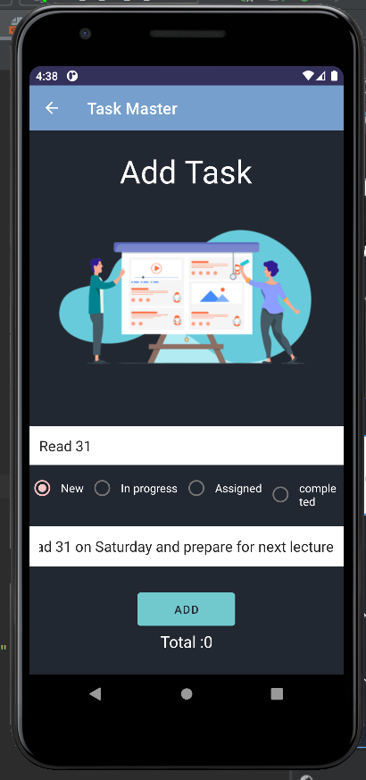

Also added a spinner in which the user can select one of the choices for the image of the task.

#### All Tasks
This is the home page and it contains tasks and each task has an image depends on the user's choice from the spinner. Also, the user can delete the task by click on the delete.

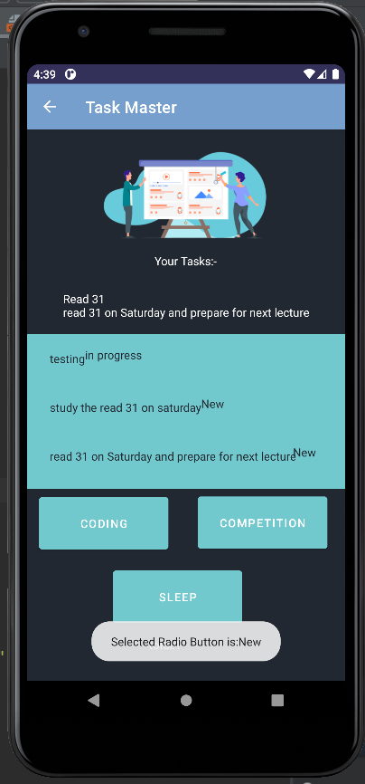

#### The added Task
Refactored this page to show all user tasks.

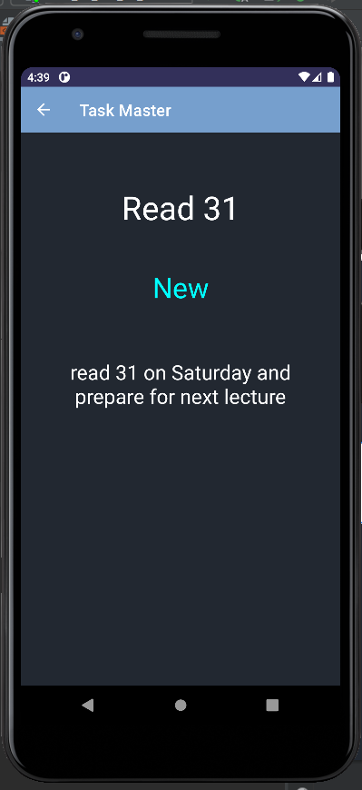

